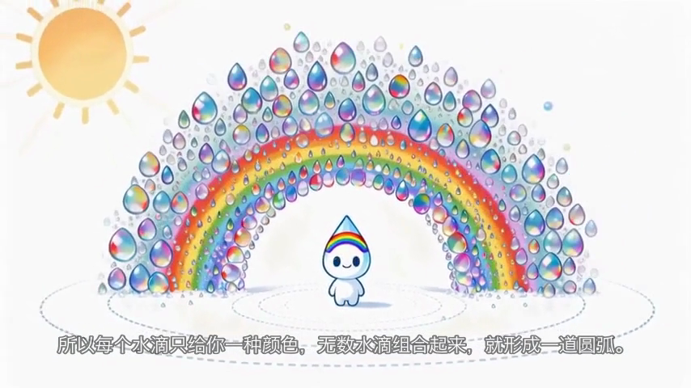

# OneTake（一条过）

> 端到端 AI 视频创作 Agent 工作台 + 其下的小型 AI 基础设施平台。
> 输入一句选题，自动完成「大纲 → 脚本 → 分镜 → 素材生成 → 配音 → 自动剪辑 → 成片」；
> 每个中间节点可查看、可修改、可重生成——确认式自动化，而非一次性黑盒生成。

个人独立开发项目（2027 校招简历项目）。对标两个岗位方向：

- **B 站【主站】AI 创作项目工程师**（Updream 最小可行复刻：Agent 创作管线 + Skills 技能库 + 长期记忆 + 多模型聚合）
- **字节跳动 后端研发工程师（AI 架构）– 剪映 CapCut**（迷你 AI 基础设施：模型服务化 + 任务调度 + 可观测性 + 数据链路）




*上图均为本系统真实产出：彩虹选题成片截图（含硬字幕）、蜂巢选题分镜图（角色锚点 + 参考图链一致性）。*

## 功能全景

| 模块 | 能力 |
|---|---|
| 创作管线 | 选题 → 大纲 → 分镜表（JSON Schema 校验 + 错误回灌）→ 角色锚点 → 分镜图 → 图生视频 → 配音 → EDL 剪辑 → 成片；两处人工确认节点；断点续跑 |
| LangGraph 编排 | StateGraph + SQLite checkpointer（进程 kill 恢复）+ interrupt 人工节点；线性版保留对照 |
| 模型网关 | 统一入口：sha256 内容寻址幂等缓存（重跑零重复扣费）、全量计费日志、日预算熔断、失败降级链（DeepSeek↔Qwen、Seedance↔fast） |
| 模型服务化 | FastAPI OpenAI 兼容内部 API + YAML 模型注册表（热更新）+ 权重灰度路由 |
| 任务调度器 | SQLite jobs 状态机 + asyncio worker 池 + 按 provider 限流 + 死信重放 + 崩溃孤儿回收 + vendor task_id 续查 |
| 可观测性 | 结构化 JSON 日志 + trace_id 贯穿（contextvars）+ stats 仪表盘 + 阈值告警 |
| 数据链路 | 事件日志 → 每日聚合（model_perf_daily）→ analyze 报告（模型对比自动结论 + 失败模式聚类 + 缓存收益趋势） |
| Skills 技能库 | YAML 创作方法论包（知识科普/影视解说）+ LLM 选择器 + 效果度量回写 |
| 长期记忆 | Mem0 式：画像/经验两类记忆，LLM 合并去重 + 置信度调整 + Top-K 注入 |
| VLM 质检 | 抽帧 + qwen3-vl-flash 双维度评分，低分自动重生成（≤2 次），质量报表 |

## 真实数据（2026-08-10，全部可经 `report`/`analyze` 复核）

- 单条 60s 成片成本 **¥7.29**（8 镜头草稿档；目标 ≤¥8 ✅）
- 同项目重跑增量成本 **¥0.00**（幂等缓存全命中，12 秒完成）
- Seedance fast vs 标准档实测：**成本低 59%、时延低 27%**（数据驱动选型）
- VLM 质检一次通过率 **100%**（8/8，评分器经错配样本验证有区分度）
- 全项目花费 **<¥80 / 预算 ¥300**

## 快速开始（约 30 分钟）

```bash
# 1. 环境：Python 3.13+、uv、含 libass 的 ffmpeg（字幕烧录必需）
brew install uv ffmpeg-full     # 或其他含 libass 的 ffmpeg 构建
git clone <repo> && cd OneTake && uv sync

# 2. 密钥（cp .env.example .env 后填入）
#    ARK_API_KEY      火山方舟（Seedream 图 + Seedance 视频，视频模型开通需 ¥200 底额）
#    DEEPSEEK_API_KEY DeepSeek（LLM 主力）
#    DASHSCOPE_API_KEY 阿里百炼（Qwen 降级 + Qwen-VL 质检，有免费额度）

# 3. 一条命令出片（约 8 分钟，~¥8）
uv run python main.py run --topic "为什么人睡觉会做梦" --auto

# 4. 看报表
uv run python main.py report          # 成本（项目/环节/档位三视图 + 命中率）
uv run python main.py stats           # 系统仪表盘（模型表现/队列/告警）
uv run python main.py analyze         # 数据分析（模型对比结论/失败聚类/缓存趋势）
uv run python main.py judge --pid <pid>   # VLM 质检
```

进阶：`--graph` LangGraph 图版（checkpointer 断点恢复）；`--skill 知识科普解说` 指定 Skill；`--pid <pid>` 断点续跑；`ONETAKE_SERVING_URL=http://127.0.0.1:8300` 走模型服务层（`uv run uvicorn serving.app:app --port 8300` 启动）。

BGM：向 `assets/bgm/` 放入任意 mp3 即可（推荐 [Pixabay Music](https://pixabay.com/music/)，见 `assets/bgm/SOURCES.md`）。

## 架构

```
接入层     CLI（typer）：run / report / stats / analyze / judge / jobs / skills / memory
编排层     pipeline/（线性版 + LangGraph 图版双轨，interrupt 人工节点）
能力层     nodes/（outline/storyboard/character/motion/judge 薄节点）
────────── 两条铁律：模型调用唯一入口 = 网关/服务层；异步重负载唯一入口 = 调度器 ──────────
服务层     serving/（FastAPI OpenAI 兼容 API + 注册表热更新 + 权重灰度路由）
网关层     gateway/（幂等缓存 / 计费 / 日熔断 / 降级链 / 厂商适配器）
调度层     scheduler/（jobs 状态机 / worker 池 / 限流 / 死信 / 崩溃回收）
观测层     observability/（JSONL 日志 / trace_id / stats / analyze）
数据层     datapipe/（events / 每日聚合 → model_perf_daily）
基础设施   SQLite（八表）+ 本地文件 + FFmpeg
```

## 文档地图

| 文件 | 内容 |
|---|---|
| `prd.md` | 完整 PRD + 技术设计（v2.1），含双 JD 映射、面试问答库（附录 C，20+ 条答题骨架） |
| `DEVLOG.md` | 23 条真实踩坑与决策记录（五段式：现象/排查/根因/解决/经验） |
| `TODO.md` | 任务清单与验收记录（P0–P7 全绿） |
| `AGENTS.md` | AI 编码助手工作守则（本项目由 AI 协作开发，过程纪律全在此） |

## 关键设计取舍（面试速览）

- **先图后视频**：构图/角色决策前置到 ¥0.20 的图片阶段，视频只做"让画面动起来"——最贵的调用做稀疏采样
- **内容寻址缓存**：`sha256(任务+模型+档位+语义参数)`，指纹原料只含语义参数（传输字段必剥离）
- **确认式自动化**：人工确认建模为 LangGraph interrupt（可持久化状态），不是进程内阻塞 IO
- **按规模选型**：SQLite 队列/缓存而非 Redis/Celery——并发 ≤5、日任务 <1000，零中间件
- **EDL 与渲染分离**：剪辑层 bug 修复零 API 成本（实战修过 3 次，一分没花）

## License

MIT（代码）。`projects/` 产物与 `assets/bgm/` 音乐文件不入库。
